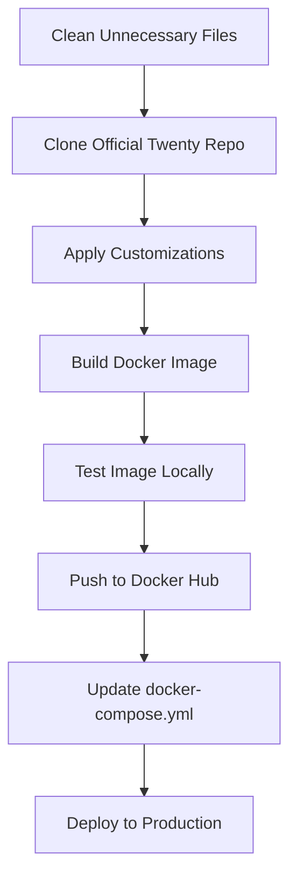

# Custom Twenty CRM Docker Image Build & Deployment Plan

## Overview

Clone the official Twenty CRM repository, apply extensive customizations, build a production-ready Docker image, publish to Docker Hub, and integrate with existing services via docker-compose.yml. All existing services remain unchanged.

## Architecture Flow

## Implementation Steps

### Phase 1: Cleanup & Preparation

1. **Clean Unnecessary Files**

   - Remove temporary build scripts that are no longer needed
   - Clean up old test/debug scripts
   - Keep only essential deployment and configuration files
   - Preserve: `docker-compose.yml`, `deploy-server.sh`, `.env` template, nginx configs, service configs

2. **Set up Docker Hub Account/Organization**

   - Create Docker Hub account if needed
   - Create organization: `wosool-ai` (or user's choice)
   - Generate access token for pushing images
   - Document credentials securely

### Phase 2: Clone & Customize Twenty CRM

1. **Clone Official Repository**

   - Clone from: `https://github.com/twentyhq/twenty`
   - Location: `twenty-crm-source/` (temporary, will be cleaned after build)
   - Use specific version/tag for stability (not `main` branch)

2. **Apply Customizations**

   - **Configuration**: Environment defaults, Clerk settings, server URL
   - **Routing**: Custom `/welcome` redirect behavior if needed
   - **Branding**: UI customizations, logos, colors
   - **Features**: Multi-tenant enhancements, custom endpoints
   - **Build**: Modify Dockerfile if needed, add custom entrypoint

3. **Customization Areas**

   - Environment variable defaults in code/config
   - Frontend routing logic
   - API endpoints
   - Database schema/migrations
   - Clerk integration code

### Phase 3: Build Docker Image

1. **Use Existing or Modified Dockerfile**

   - Check if Twenty repo has Dockerfile
   - Modify or create custom Dockerfile if needed
   - Ensure multi-stage build for optimization
   - Include all customizations
   - Set proper entrypoint

2. **Build Process**

   - Build from cloned repository directory
   - Tag appropriately: `wosool-ai/twenty-crm:latest` and version tags
   - Optimize for production (small size, security)
   - Test build locally before pushing

### Phase 4: Publish to Docker Hub

1. **Tag Image**

   - `wosool-ai/twenty-crm:latest`
   - `wosool-ai/twenty-crm:v1.0.0` (version tag)
   - Optional: `wosool-ai/twenty-crm:v1.0.0-<date>` for tracking

2. **Push to Docker Hub**

   - Login to Docker Hub
   - Push all tags
   - Verify image is accessible

### Phase 5: Update Production Configuration

1. **Update docker-compose.yml**

   - Change `image: twentycrm/twenty:latest`
   - To: `image: wosool-ai/twenty-crm:latest`
   - Keep all existing environment variables unchanged
   - Maintain all service dependencies
   - No changes to other services (tenant-manager, nginx, etc.)

2. **Verify Compatibility**

   - Ensure new image works with existing environment variables
   - Test that all services still connect properly
   - Verify health checks work

### Phase 6: Cleanup After Build

1. **Remove Temporary Files**

   - Delete cloned `twenty-crm-source/` directory
   - Remove any temporary build artifacts
   - Keep only essential files in repository
   - Update `.gitignore` if needed

### Phase 7: Documentation

1. **Create Build Documentation**

   - Document the build process
   - List all customizations made
   - Provide instructions for rebuilding
   - Include version information
   - Document Docker Hub image location

## Key Files to Create/Modify

1. `BUILD-CUSTOM-TWENTY.md` - Main documentation file (in repo root)
2. `twenty-crm-source/` - Cloned Twenty CRM repository (temporary, deleted after build)
3. Modified Dockerfile in cloned repo (if needed)
4. Customization files in cloned repo
5. `docker-compose.yml` - Update image reference only

## Security Considerations

- Use non-root user in container
- Scan images for vulnerabilities
- Use specific base image tags (not `latest`)
- Minimize image size
- Use multi-stage builds
- Secure secrets handling

## Production Readiness Checklist

- [ ] Image builds successfully
- [ ] All tests pass
- [ ] Image size optimized
- [ ] Security scan passed
- [ ] Documentation complete
- [ ] Versioning strategy defined
- [ ] CI/CD pipeline working
- [ ] Rollback plan documented
- [ ] Monitoring configured

## Next Steps After Plan Approval

1. Set up Docker Hub account/organization
2. Clone Twenty CRM repository
3. Create build directory structure
4. Build initial Dockerfile
5. Test build process
6. Implement customizations
7. Set up publishing workflow
8. Integrate with existing deployment